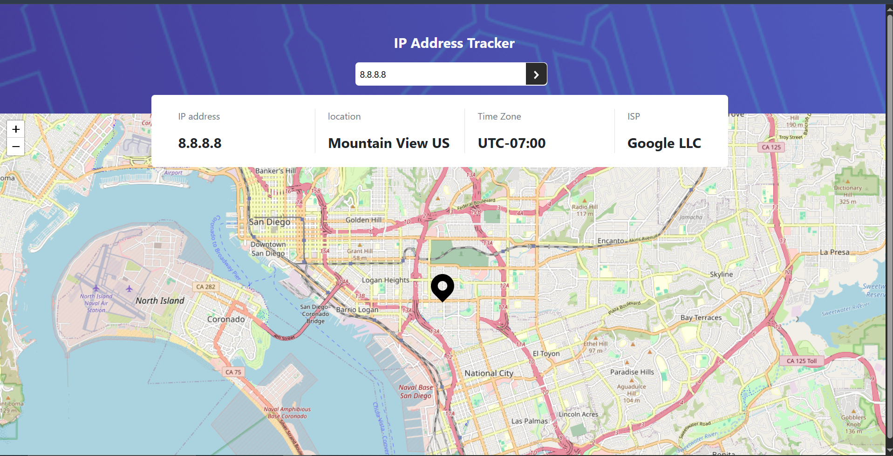

# Frontend Mentor - IP Address Tracker Solution

This is a solution to the [IP address tracker challenge on Frontend Mentor](https://www.frontendmentor.io/challenges/ip-address-tracker-I8-0yYAH0). Frontend Mentor challenges help you improve your coding skills by building realistic projects.

## Table of contents

- [Overview](#overview)
  - [The challenge](#the-challenge)
  - [Screenshot](#screenshot)
  - [Links](#links)
- [My process](#my-process)
  - [Built with](#built-with)
  - [What I learned](#what-i-learned)
  - [Continued development](#continued-development)
- [Author](#author)

## Overview

### The challenge

Users should be able to:

- View the optimal layout for each page depending on their device's screen size
- See hover states for all interactive elements on the page
- See their own IP address on the map on the initial page load
- Search for any IP addresses or domains and see the key information and location

### Screenshot



### Links

- Solution URL: [[Add your GitHub repo link here](https://github.com/Amro6779/IP-tracker)]
- Live Site URL: [Add your live site link here](https://amro6779.github.io/IP-tracker/)

## My process

### Built with

- Semantic HTML5 markup
- CSS custom properties
- [Bootstrap 5](https://getbootstrap.com/) - for the grid system and layout utilities
- [Leaflet.js](https://leafletjs.com/) - for the interactive map, self-hosted rather than loaded from a CDN
- [IPify Geolocation API](https://geo.ipify.org/) - to resolve an IP address or domain into location data
- Vanilla JavaScript (`fetch`, `async/await`, DOM manipulation, no frameworks)

### What I learned

This was the first project in this series that involved a real external API and asynchronous data, which introduced several new concepts beyond what earlier vanilla JS projects covered.

**Keeping an API key out of a public repository**

Since committing an API key directly to a public GitHub repo would expose it to anyone, I split configuration into two files: a `config.js` holding the real key (added to `.gitignore` so Git never tracks it), and a `config.example.js` with a placeholder value that *is* committed, so anyone cloning the repo knows what file to create and how to structure it.

**`fetch()` returns a Response object, not the data itself**

A `fetch()` call resolves to a `Response` object - metadata about the request (status, headers, etc.) - not the JSON body directly. Getting the actual data requires an extra, separately-awaited step:

```js
let response = await fetch(url);
let data = await response.json();
```

**Requesting your own IP vs. a specific IP with the same endpoint**

The same IPify endpoint serves two purposes depending on the query string: omitting `ipAddress` entirely returns geolocation data for whoever made the request (used on initial page load), while including `ipAddress=<value>` looks up that specific IP or domain (used for the search feature). Both cases route through the same `getData(ip)` function, parameterized by the IP to look up.

**Async timing and script order still matter with real APIs**

`getData()` runs immediately on page load to satisfy the "show the user's own IP on load" requirement. Since it calls `updateMap()` after its `await` resolves, the Leaflet map and marker had to be initialized *before* that initial call in the script - otherwise there's a real risk (especially on a slow connection) that `updateMap()` fires before `map` and `marker` even exist.

**Handling incomplete data from a real API**

Not every IP address in IPify's database has a postal code - some return an empty string for `postalCode`. Building the location string conditionally (only appending the postal code when it's present) avoids trailing whitespace or a dangling piece of punctuation in the UI, which is the kind of edge case you don't see until you test with real, unpredictable data instead of a fixed local array.

### Continued development

Things I'd like to keep improving in future projects:

- Add input validation and a visible error state for invalid IP addresses or domains submitted through the search bar
- Add full hover and focus states for the search button and other interactive elements per the challenge requirements
- Explore moving the API key handling to environment variables with a lightweight build tool instead of the `.gitignore` + example-file approach, for projects that do end up needing a build step

## Author

- Frontend Mentor - [@Amro](https://www.frontendmentor.io/profile/Amro6779)
